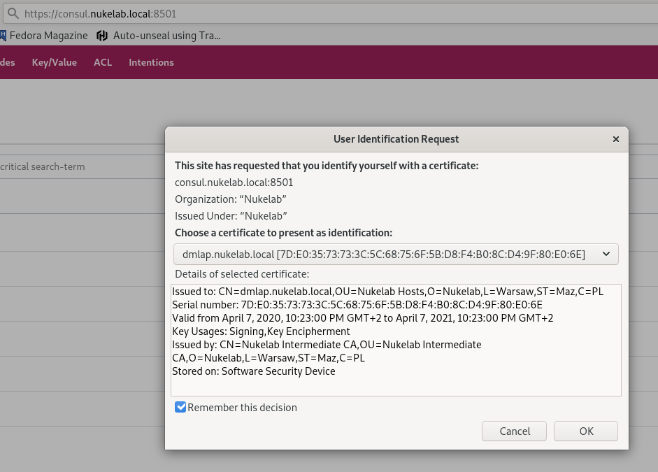
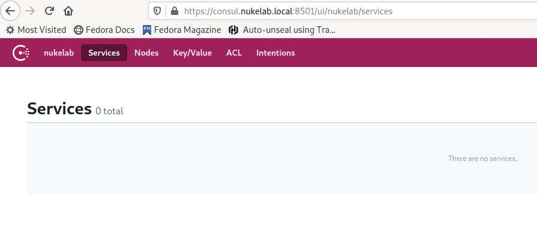
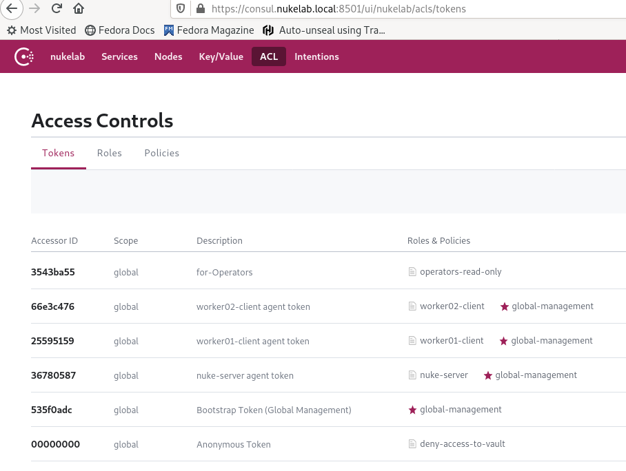

### Setting up Consul
---

#### 1. Create firewalld services for Consul.

We have to create tcp and udp services called "_Consul services_" and apply them to libvirtd zone: 

* tcp ports: 8300, 8301, 8302, 8400, 8500, 8600 
* udp: 8301, 8302, 8600

#### 2. Create Consul encryption key 

This encryption key is required to provide encryption to communication between agents (in server and client mode).
```
consul keygen
uFO39ExWFLHFf/TwnOPdkhROaowqnfyKyaMht/BC/A8=
```

#### 3. Create config for the server

Now we can create a config file for the server in *.json* format.

(/etc/consul.d/consul.json)
```
{
    # min. number of the server to initialize the consul cluster
    "bootstrap_expect": 1,
    # default setting, consul client will listen on all ifaces incl. loopback - good for CLI
    "client_addr": "0.0.0.0",
    # name of your datacenter
    "datacenter": "nukelab",
    # where all the operational data of the cluster is stored
    "data_dir": "/var/devops/consul",
    # cluster domain name
    "domain": "consul",
    "enable_script_checks": true,
    "dns_config": {
        "enable_truncate": true,
        "only_passing": true
    },
    # enable logging to system logs
    "enable_syslog": true,
    # our encryption key generated in step 2
    "encrypt": "uFO39ExWFLHFf/TwnOPdkhROaowqnfyKyaMht/BC/A8=",
    "leave_on_terminate": true,
    "log_level": "INFO",
    "rejoin_after_leave": true,
    # is this agent a server?
    "server": true,
    # join itself
    "start_join": [
        "192.168.100.1"
    ],
    # turn on webUI
    "ui": true
}
```

#### 4. Create config for consul clients

(both 192.168.100.101 & 102 - /etc/consul.d/consul.json)

```
{
    "client_addr": "0.0.0.0",
    "datacenter": "nukelab",
    "data_dir": "/var/devops/consul",
    "domain": "consul",
    "enable_script_checks": true,
    "dns_config": {
        "enable_truncate": true,
        "only_passing": true
    },
    "enable_syslog": true,
    "encrypt": "uFO39ExWFLHFf/TwnOPdkhROaowqnfyKyaMht/BC/A8=",
    "leave_on_terminate": true,
    "log_level": "INFO",
    "rejoin_after_leave": true,
    # we workers are not servers
    "server": false,
    "start_join": [
        "192.168.100.1"
    ],
    "ui": true
}
```

#### 5. Modify consul.service
(/etc/systemd/system/consul.service)
Modify the `ExecStart` entry to bind the agent to specific interface on the server and the workers.

```
[Unit]
Description=Consul Startup process
After=network.target
 
[Service]
Type=simple
ExecStart=/bin/bash -c '/usr/local/bin/consul agent -config-dir /etc/consul.d/ **-bind 192.168.100.1** *[101 and 102]*'
TimeoutStartSec=0
 
[Install]
WantedBy=default.target
```

Start and check consul cluster setup:
```
$ sudo systemctl daemon-reload
$ sudo systemctl start consul
```
..and check Consul:

```
$ consul members
Node                Address               Status  Type    Build  Protocol  DC       Segment
nuke.nukelab.local  192.168.100.1:8301    alive   server  1.7.2  2         nukelab  <all>
worker01            192.168.100.101:8301  alive   client  1.7.2  2         nukelab  <default>
worker02            192.168.100.102:8301  alive   client  1.7.2  2         nukelab  <default>
```

Now, we can go to the [vault setup](../vault/README.md) and get the basic vault cluster running. Once we get that done, we will come back and follow up remaining steps on TLS and ACL for consul.


### Setting up TLS for consul
---

#### 1. extend the *consul.json* config on the server by the following entries:
(Note: we use the same certificates we have created for Nomad),
```
  "verify_incoming": true,
   "verify_outgoing": true,
   "verify_server_hostname": true,
   "ca_file": "/etc/consul.d/certs/intermediate_ca.pem",
   "cert_file": "/etc/consul.d/certs/nuke-peer.pem",
   "key_file": "/etc/consul.d/certs/nuke-peer-key.pem",
   "auto_encrypt": {
   "allow_tls": true
```

#### 2. Configure the consul clients

Add the below piece of config to the _consul.json_ file
```
  "verify_incoming": false,
  "verify_outgoing": true,
  "verify_server_hostname": true,
  "ca_file": "intermediate_ca.pem",
  "auto_encrypt": {
    "tls": true
  }
```

#### 3. Restart consul server and the clients

```
$ sudo systemctl restart consul
$ sudo systemctl status consul
[..]
Apr 08 10:35:11 nuke.nukelab.local bash[25454]:     2020-04-08T10:35:11.308+0200 [INFO]  agent: Synced node info
Apr 08 10:35:11 nuke.nukelab.local consul[25454]:  agent: Synced node info
Apr 08 10:35:18 nuke.nukelab.local bash[25454]:     2020-04-08T10:35:18.733+0200 [INFO]  agent.server.serf.lan: serf: EventMemberJoin: worker01 192.168.100.101
Apr 08 10:35:18 nuke.nukelab.local bash[25454]:     2020-04-08T10:35:18.733+0200 [INFO]  agent.server: member joined, marking health alive: member=worker01
Apr 08 10:35:18 nuke.nukelab.local consul[25454]:  agent.server.serf.lan: serf: EventMemberJoin: worker01 192.168.100.101
Apr 08 10:35:18 nuke.nukelab.local consul[25454]:  agent.server: member joined, marking health alive: member=worker01
Apr 08 10:35:35 nuke.nukelab.local bash[25454]:     2020-04-08T10:35:35.593+0200 [INFO]  agent.server.serf.lan: serf: EventMemberJoin: worker02 192.168.100.102
Apr 08 10:35:35 nuke.nukelab.local bash[25454]:     2020-04-08T10:35:35.594+0200 [INFO]  agent.server: member joined, marking health alive: member=worker02
Apr 08 10:35:35 nuke.nukelab.local consul[25454]:  agent.server.serf.lan: serf: EventMemberJoin: worker02 192.168.100.102
Apr 08 10:35:35 nuke.nukelab.local consul[25454]:  agent.server: member joined, marking health alive: member=worker02
```

#### 4. You can define HTTPS access only

By adding this piece to the /etc/consul.d/consul.json:
```
[..]
"ports": {
        "http": -1,    # turn off http
        "https": 8500  # leave the https on 8500
    },
 [..]
```

Please note, that now your browser has to have a client certificate to present to consul server set for mutual authentication.
Use this [tutorial](install-certs.md) to create another client cert and add it to your browser.

#### 5. Final configs

Ultimately, your consul server _consul.json_ file should look like this:
```
{
    "bootstrap_expect": 1,
    "client_addr": "0.0.0.0",
    "datacenter": "nukelab",
    "data_dir": "/var/devops/consul",
    "domain": "consul",
    "enable_script_checks": true,
    "dns_config": {
        "enable_truncate": true,
        "only_passing": true
    },
    "ports": {
        "http": 8500,
        "https": 8501
    },
    "enable_syslog": true,
    "encrypt": "uFO39ExWFLHFf/TwnOPdkhROaowqnfyKyaMht/BC/A8=",
    "leave_on_terminate": true,
    "log_level": "INFO",
    "rejoin_after_leave": true,
    "server": true,
    "start_join": [
        "192.168.100.1"
    ],
    "ui": true,
    "verify_incoming": true,
    "verify_outgoing": true,
    "verify_server_hostname": true,
    "ca_file": "/etc/consul.d/certs/intermediate_ca.pem",
    "cert_file": "/etc/consul.d/certs/nuke-peer.pem",
    "key_file": "/etc/consul.d/certs/nuke-peer-key.pem",
    "auto_encrypt": {
    "allow_tls": true
  }

}
```

And the client configs (on both nodes) should look like in the below snippet. Please make sure you've got appropriate certificates places in both nodes.
```
{
    "client_addr": "0.0.0.0",
    "datacenter": "nukelab",
    "data_dir": "/var/devops/consul",
    "domain": "consul",
    "enable_script_checks": true,
    "dns_config": {
        "enable_truncate": true,
        "only_passing": true
    },
    "enable_syslog": true,
    "encrypt": "uFO39ExWFLHFf/TwnOPdkhROaowqnfyKyaMht/BC/A8=",
    "leave_on_terminate": true,
    "log_level": "INFO",
    "rejoin_after_leave": true,
    "server": false,
    "start_join": [
        "192.168.100.1"
    ],
    "ui": true,

    "verify_incoming": true,
    "verify_outgoing": true,
    "verify_server_hostname": true,
    "ca_file": "/etc/consul.d/certs/intermediate_ca.pem",
    "cert_file": "/etc/consul.d/certs/worker01-client.pem",
    "key_file": "/etc/consul.d/certs/worker01-client-key.pem",
    "auto_encrypt": {
    "tls": true
    }
}
``` 

Our Consul cluster can enjoy now secured communication.

### ACL for Consul.
---

#### 1. Bootstrap the ACL sub-system on Consul

Put the following config into all agent.hcl:

```
acl = {
  enabled = true
  default_policy = "allow"
  enable_token_persistence = true
}
```

This will bootstrap ACL on consul and set token persistence - so they are stored on disk (at the default location defined in the configuration file) and loaded up at any restart.
Now, restart consul server & clients.

`$ sudo systemctl restart consul`

The logs will show clients inability to talk to the server now on, until we fix it.

```
pr 10 11:06:37 nuke.nukelab.local bash[13628]:     2020-04-10T11:06:37.989+0200 [ERROR] agent.http: Request error: method=PUT url=/v1/agent/check/pass/vault:192.168.100.101:8200:vault-sealed-check?note=Vault+Unsealed from=>
Apr 10 11:06:37 nuke.nukelab.local consul[13628]: agent.http: Request error: method=PUT url=/v1/agent/check/pass/vault:192.168.100.101:8200:vault-sealed-check?note=Vault+Unsealed from=192.168.100.101:39674 error="ACL not fo>
Apr 10 11:06:38 nuke.nukelab.local bash[13628]:     2020-04-10T11:06:38.240+0200 [ERROR] agent.http: Request error: method=GET url=/v1/kv/vault/core/lock from=192.168.100.101:39674 error="ACL not found"
Apr 10 11:06:38 nuke.nukelab.local consul[13628]: agent.http: Request error: method=GET url=/v1/kv/vault/core/lock from=192.168.100.101:39674 error="ACL not found"
Apr 10 11:06:38 nuke.nukelab.local bash[13628]:     2020-04-10T11:06:38.247+0200 [ERROR] agent.http: Request error: method=GET url=/v1/catalog/service/vault?stale= from=192.168.100.101:39678 error="ACL not found"
Apr 10 11:06:38 nuke.nukelab.local consul[13628]: agent.http: Request error: method=GET url=/v1/catalog/service/vault?stale= from=192.168.100.101:39678 error="ACL not found"
Apr 10 11:06:38 nuke.nukelab.local bash[13628]:     2020-04-10T11:06:38.249+0200 [ERROR] agent.http: Request error: method=PUT url=/v1/agent/service/register from=192.168.100.101:39678 error="ACL not found"
Apr 10 11:06:38 nuke.nukelab.local consul[13628]: agent.http: Request error: method=PUT url=/v1/agent/service/register from=192.168.100.101:39678 error="ACL not found"
Apr 10 11:06:38 nuke.nukelab.local bash[13628]:     2020-04-10T11:06:38.323+0200 [ERROR] agent.http: Request error: method=GET url=/v1/kv/vault/core/lock from=192.168.100.1:39640 error="ACL not found"
Apr 10 11:06:38 nuke.nukelab.local consul[13628]: agent.http: Request error: method=GET url=/v1/kv/vault/core/lock from=192.168.100.1:39640 error="ACL not found"
```

(our vault can be broken now on, as well - no worries)

#### 2. Check consul server access and boostrap the acl on it

`$ export CONSUL_HTTP_ADDR=http://consul.nukelab.local:8500`
`$ consul members`
`$ consul acl bootstrap`

We are getting the following output:
```
AccessorID:       535f0adc-b4bf-54ac-1366-b40fc33f52cf
SecretID:         4ce82d60-a6d3-49f1-c9d1-75396ed74e43
Description:      Bootstrap Token (Global Management)
Local:            false
Create Time:      2020-04-10 11:08:34.681149012 +0200 CEST
Policies:
   00000000-0000-0000-0000-000000000001 - global-management
```

By default, Consul assigns a global-management policy with unrestricted priviledges to the bootstrap token. This token with unrestricted privileges can be a useful backdoor, in case of emergencies; however you should only give access to it to a small number of administrators. The SecretID is a UUID that you will use to identify the token when using the Consul CLI or API.

#### 3. Now, set the CONSUL_HTTP_TOKEN

`$export CONSUL_HTTP_TOKEN=4ce82d60-a6d3-49f1-c9d1-75396ed74e43`

#### 4. Create server agent policy

* nuke-server is the consul server
* worker01-client is the consul client
* worker02-client is the consul client as well.

consul-server-policy.hcl file:
```
node "nuke-server" {
  policy = "write"
}
```

#### 5. Apply the policy 

`$ consul acl policy create -name nuke-server -rules @consul-server-policy.hcl`

```
ID:           f010d909-ff9c-f3c1-7dfc-752babd5d1c2
Name:         nuke-server
Description:  
Datacenters:  
Rules:
node "nuke-server" {
  policy = "write"
}
```
create the policies on the client agents and apply them to local agents likewise.

```
consul acl policy create -name worker01-client -rules @policy-client-worker01.hcl
ID:           7a43439b-7f1e-b9be-ea56-cf1b00f9d420
Name:         worker01-client
Description:  
Datacenters:  
Rules:
node "worker01-client" {
  policy = "write"
}
```
```
consul acl policy create -name worker02-client -rules @policy-client-worker02.hcl
ID:           fec686e7-ec8c-4556-8189-516c3e0b6fac
Name:         worker02-client
Description:  
Datacenters:  
Rules:
node "worker02-client" {
  policy = "write"
}
```
#### 6. Now, create tokens for the policies 
Each policy needs the token, so perform the token creation on each node:

* Server:
`$ consul acl token create -description "nuke-server agent token" -policy-name nuke-server`

```
AccessorID:       36780587-0a2d-7bfb-d705-e1554d053de8
SecretID:         2ca570cd-a15e-2548-d974-d144561243a9
Description:      nuke-server agent token
Local:            false
Create Time:      2020-04-10 11:39:04.45009545 +0200 CEST
Policies:
   f010d909-ff9c-f3c1-7dfc-752babd5d1c2 - nuke-server
```
* Client - worker01:
`$ consul acl token create -description "worker01-client agent token" -policy-name worker01-client`

```
AccessorID:       25595159-38d8-a201-4c28-2ad62c991861
SecretID:         cffc23d5-c6fd-2509-ae1c-76c219383b35
Description:      worker01-client agent token
Local:            false
Create Time:      2020-04-10 11:40:41.794019475 +0200 CEST
Policies:
   7a43439b-7f1e-b9be-ea56-cf1b00f9d420 - worker01-client
```
* Client - worker02:
`$ consul acl token create -description "worker02-client agent token" -policy-name worker02-client`

```
AccessorID:       66e3c476-c0f4-a9a5-100c-ca1ebc412d49
SecretID:         212de745-0d42-0973-235f-5f73aa4aaa86
Description:      worker02-client agent token
Local:            false
Create Time:      2020-04-10 11:41:39.236868587 +0200 CEST
Policies:
   fec686e7-ec8c-4556-8189-516c3e0b6fac - worker02-client
```

#### 7. Add each agent's token to the respective agents:

* Server:
`$ consul acl set-agent-token agent 2ca570cd-a15e-2548-d974-d144561243a9`
`ACL token "agent" set successfully`
* Worker01:
`$ consul acl set-agent-token agent cffc23d5-c6fd-2509-ae1c-76c219383b35`
`ACL token "agent" set successfully`
* Worker02:
`$ consul acl set-agent-token agent 212de745-0d42-0973-235f-5f73aa4aaa86`
`ACL token "agent" set successfully`

and in the agent.hcl "acl" stanza add the following entry for each agent with respective token:

i.e. for server:
```
  tokens = {
    agent = "2ca570cd-a15e-2548-d974-d144561243a9"
  }
```
.. and so on for the client agents.

Now, remember, that vault which uses consul as backend is still broken.. try it:

```
$ export VAULT_ADDR=https://192.168.100.1:8200
$ vault status
Error checking seal status: Error making API request.

URL: GET https://192.168.100.1:8200/v1/sys/seal-status
Code: 500. Errors:

* Unexpected response code: 403
```

#### 8. Token for the Vault cluster

Now, in the /etc/vault.d/vault.hcl on each node of the vault cluster, put the respective token - the SecretID from the step 6.

#### 9. Check it now:

```
$ vault status
vault status
Key                      Value
---                      -----
Recovery Seal Type       shamir
Initialized              true
Sealed                   false
Total Recovery Shares    5
Threshold                3
Version                  1.3.4
Cluster Name             vault-cluster-b238dd96
Cluster ID               f047ff31-214b-27f9-b047-2338d784206a
HA Enabled               true
HA Cluster               https://192.168.100.1:8201
HA Mode                  active
```

#### 10. ACL to the Consul WebUI

So that only those in possession of the specific token will be able to perform CLI or curl API operations.

- create role Operators and policy operators-read-only, assign token
- write down global token management 
- set the ACL default policy to "deny" in the agent.hcl config files on all consul agents, all consul agents and vault are already whitelisted, restart.

test ACL on vault KV in Consul - clean the var and then set it with the global management policy token:

```
$ unset CONSUL_HTTP_TOKEN
$ consul kv export vault/
[]
$ export CONSUL_HTTP_TOKEN=4ce82d60-a6d3-49f1-c9d1-75396ed74e43
$ consul kv export vault/
[
	{
		"key": "vault/core/audit",
		"flags": 0,
		"value": "AAAAAQLQz9CfS4roOL2Y
[..]
```

We are set. The ultimate consul agent ACL config file `/etc/consul.d/agent.hcl` looks like this:

```
acl = {
  enabled = true
  default_policy = "deny"
  enable_token_persistence = true
  tokens = {
    # token for nuke-server policy
    agent = "2ca570cd-a15e-2548-d974-d144561243a9"
    # token for global mgmt policy
    agent = "4ce82d60-a6d3-49f1-c9d1-75396ed74e43"
  }
}
```

The ACL for the client node agents differ only with the first agent token (the client access policy token).

#### 11. Set secure UI access to Consul

As you remember from the [cfssl tutorial](../cfssl/README.md), you had to generate your client cert for your browser. Well, that was not all, browsers need that bundled in the PKCS12 format with export password and username, to simply confirm that this "Your Certificate" is yours. So, once you get your laptop/workstation cert and key (.pem) generated, you have to transform that into the PFX bundle:
`openssl pkcs12 -export -inkey dmlap-client-key.pem  -in dmlap-client.pem -name <my_username> -out dmlap_<my_username>.pfx`

It's going to ask you for your export password, which you will need to import the .PFX file to your browser cert store. Once you have that cert file imported in your browser store, you can go now to `https://consul.nukelab.local:8501`. The Consul server will ask:


What you will see is just an empty Consul UI 



why? because now, you have to go to the ACL tab and put the access token, which you already used in your CONSUL_HTTP_TOKEN, remember?


